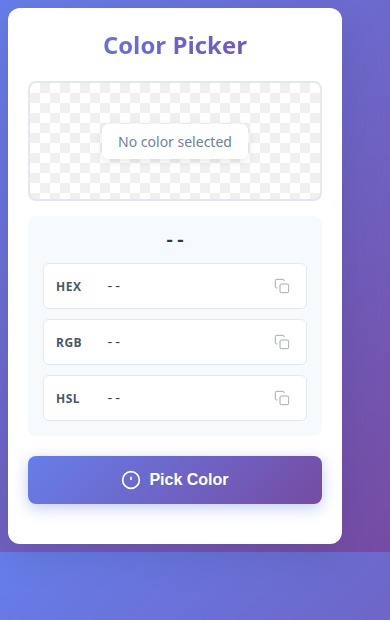

# Color Picker Chrome Extension

A lightweight Chrome extension for picking colors from anywhere on your screen. Selected colors are shown as **HEX**, **RGB**, and **HSL**, with one-click copy to the clipboard.



## Overview

Click the toolbar icon, tap **Pick Color**, and use the system eyedropper to sample any pixel. The popup preview updates immediately, and you can copy whichever format you need for CSS, design tools, or documentation.

## Tech stack

| Layer | Technology |
| --- | --- |
| Platform | Chrome Extension (Manifest V3) |
| Language | Vanilla HTML, CSS, and JavaScript |
| Color sampling | [EyeDropper API](https://developer.mozilla.org/en-US/docs/Web/API/EyeDropper) |
| Persistence | `chrome.storage.local` |
| Background | Service worker + offscreen document |

## Features

- **Eyedropper** — pick a color from any visible pixel on the screen
- **Multiple formats** — HEX, RGB, and HSL shown together
- **Copy to clipboard** — one click per format
- **Last color restore** — the most recently picked color is stored and shown when you reopen the popup
- **Modern popup UI** — gradient chrome, preview swatch, and toast confirmation

## Dependencies

This project has **no npm packages**. It uses only browser and Chrome extension APIs:

- Chrome Extension APIs: `chrome.runtime`, `chrome.offscreen`, `chrome.storage`
- Web APIs: `EyeDropper`, `navigator.clipboard`

**Permissions** (see `manifest.json`): `activeTab`, `offscreen`, `storage`.

## Run locally

Chrome 95+ (or another Chromium browser with the EyeDropper API) is required.

1. Clone this repository:

   ```bash
   git clone https://github.com/SalmanAAbir/color-picker-extension.git
   cd color-picker-extension
   ```

2. Open Chrome and go to `chrome://extensions/`
3. Turn on **Developer mode**
4. Click **Load unpacked**
5. Select this project folder
6. Pin the **Color Picker** icon from the toolbar, then click it to open the popup

### Usage

1. Click **Pick Color** (the popup closes so you can see the page)
2. Move the eyedropper over the color you want and click
3. Reopen the extension to see HEX / RGB / HSL
4. Click a copy icon next to any format

## Links

| | |
| --- | --- |
| Repository | https://github.com/SalmanAAbir/color-picker-extension |
| Live / store listing | Not published on the Chrome Web Store yet — load from source as above |
| EyeDropper API docs | https://developer.mozilla.org/en-US/docs/Web/API/EyeDropper |
| Manifest V3 docs | https://developer.chrome.com/docs/extensions/mv3/intro/ |

## Browser compatibility

Works in Chrome 95+ and other Chromium browsers (Edge, Brave, etc.) that implement the EyeDropper API.
